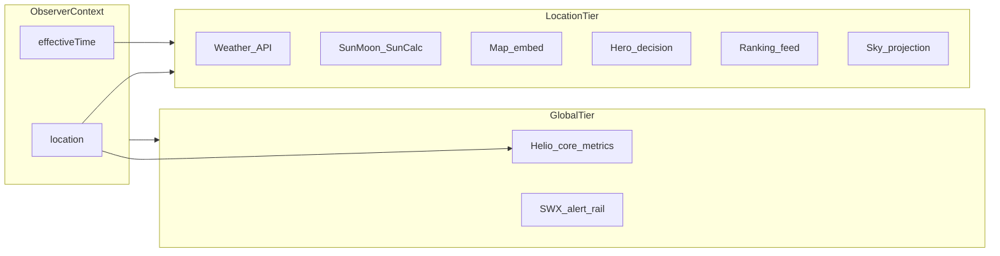

# Location propagation audit — Observer Console

This document satisfies the spike *Global Location Propagation* (analysis only, no implementation). It audits how dashboard-related surfaces obtain **location (lat/lon, timezone)** and **effective time** (control-bar “player”), classifies update behavior, and proposes a target architecture.

**Scope:** Primary shell is [`sites/staging/index.html`](/sites/staging/index.html). Shared store is [`sites/staging/weather/core/state.js`](/sites/staging/weather/core/state.js). Related standalone entrypoints: [`sites/staging/weather/index.html`](/sites/staging/weather/index.html), [`sites/staging/sky/index.html`](/sites/staging/sky/index.html), [`sites/staging/helio/index.html`](/sites/staging/helio/index.html).

---

## 1. Overview

The console exposes a **top bar** with `mountLocation` (global location) and a **time player** (`cb-*` buttons) intended to drive context for all widgets.

Today:

- **Location** is well-centralized in `state.js` (URL sync, `localStorage`, `subscribe`, `window` event `nc:state`). Several widgets consume it via `storeApi`.
- **Precomputed JSON** under `/data/*.json` and `/sky/data/*.json` is overwhelmingly built for a **fixed default site** (Warsaw: 52.2297°N, 21.0122°E) in Python pipelines (`SITE_LAT_DEG` / `OBSERVER_LAT` constants in `services/sky/pipelines/`). Changing the UI location **does not** regenerate those files.
- **Effective time** from the control bar is **not** stored in `state.js`. `_cbSetTime` calls `setState({ time: { datetimeISO } })`, but `setState` only merges `location`, `profile`, `range`, and `source` — so **`time` is dropped** while `emit()` still runs. Sky’s `pickDatetimeISO()` therefore never reads a persisted scrub time from the store.

Consequence: the product can show one observer in the top bar while hero feeds, ranking, and static sky JSON still describe **another** site, and the time player can be **visually** out of sync with data that still keys off wall-clock “now” or baked JSON epochs.

---

## 2. Component inventory

| # | Surface | DOM / entry | Primary implementation |
|---|---------|--------------|-------------------------|
| 1 | Top bar — Location | `#w-location` | `mountLocation` → [`weather/widgets/location/location.js`](/sites/staging/weather/widgets/location/location.js) + `storeApi` |
| 2 | Top bar — Time player | `#cb-*`, `#cb-time` | Inline in [`index.html`](/sites/staging/index.html) (`_cbSetTime`); intended consumer: Sky via `pickDatetimeISO` (broken link — see §4) |
| 3 | Dashboard hero (“Night Overview Panel”) | `#console-hero` | Inline `loadHero()` in `index.html` |
| 4 | Weather / conditions | `#w-weather` | `mountWeather` → [`weather/widgets/weather/weather.js`](/sites/staging/weather/widgets/weather/weather.js) |
| 5 | Space weather (embedded) | `#w-helio` | `HelioWidget.mount` / `updateLocation` → [`helio/dist/helio.widget.js`](/sites/staging/helio/dist/helio.widget.js) |
| 6 | Sky (full page) | `#skyMount` | Lazy `import('/sky/widget.js')` + `syncSkyFromState` in `index.html`; core [`sky/widget.js`](/sites/staging/sky/widget.js) |
| 7 | Sun & Moon | `#w-sun` | `mountSunMoon` → [`weather/widgets/sun_moon/sun_moon.js`](/sites/staging/weather/widgets/sun_moon/sun_moon.js) |
| 8 | Map | `#mapIframe` | Lazy `src=/weather/map-poc.html`; `postMessage` `update-location` |
| 9 | Events — Calendar | `#nrc-main` | `runCalendarWidget` → [`assets/js/widget_runtime.js`](/sites/staging/assets/js/widget_runtime.js) |
| 10 | Events — News | `#nrw-main` | `runNewsWidget` → `widget_runtime.js` |
| 11 | Events — Observer panel | `#w-observer-weather` | `runObserverWeatherPanel` → [`assets/js/widget_observer_weather.js`](/sites/staging/assets/js/widget_observer_weather.js) |
| 12 | Right rail — Space weather alerts | `#swx-list` | `loadSwxAlerts()` in `index.html` |
| 13 | Right rail — Sky alerts | `#sky-list` | `loadSkyAlerts()` |
| 14 | Right rail — Best objects | `#feed-list` | `loadFeed()` |
| 15 | Right rail — Calendar / News | `#cal-list`, `#news-list` | `loadCalendarEvents()`, `loadNewsItems()` |
| 16 | Showcase | iframe `/showcase/` | External bundle |
| 17 | Stats / Settings | placeholder pages | No data layer |
| 18 | Standalone Weather page | `weather/index.html` | Same widgets + optional `mountMap`, `mountAstro` |
| 19 | Standalone Sky page | `sky/index.html` | Fixed `SKY_CONFIG` lat/lon in page |
| 20 | Standalone Helio | `helio/index.html` | Helio mount (separate from console store unless wired) |

---

## 3. Detailed audit table

**Loc dep / Time dep:** does output depend on observer location or on time? **Validity:** if the user changes location/time and no further code runs — **correct**, **partial**, or **wrong** relative to the UI. **Change:** `NONE` | `FRONTEND_ONLY` | `REFETCH_REQUIRED` | `BACKEND_REQUIRED`.

| Component | Data source | Loc dep | Time dep | Location / time handling | On loc change | Validity | Change |
|-----------|-------------|---------|----------|--------------------------|---------------|----------|--------|
| Location control | UI + `state.js` | Yes | No | Writes `state.location` | — | — | **NONE** |
| Time player | `_cbSelectedISO` + `setState({time})` (not merged) | No | Yes | **Time not in `getState()`** | Subscribers lack scrub ISO | **partial** | **FRONTEND_ONLY** |
| Hero (NOP) | `observer_weather_now.json`, `helio_now.json`, `sun_moon.json` | Partial | Yes | Fixed URLs | No refetch | **wrong** | **REFETCH_REQUIRED** + **BACKEND_REQUIRED** |
| Weather widget | Astro API or legacy JSON | Yes | Yes | `storeApi` | Refetch when `lat,lon` changes | **correct** (API); time N/A | **FRONTEND_ONLY** (+ API “as-of” = backend) |
| Helio widget | `helio_now.json` | Partial | Mostly no | Mount + `updateLocation` | Site label updates | **partial** | **NONE** / **FRONTEND_ONLY** |
| Sky widget | Client math + `/sky/data/*` | Yes | Yes | `syncSkyFromState` | Patch lat/lon | **partial** | **FRONTEND_ONLY** + **BACKEND_REQUIRED** |
| Sun & Moon | SunCalc | Yes | Yes | `subscribe` | Recompute | **correct** | **NONE** |
| Map iframe | `map-poc.html` | Yes | Yes | `postMessage` | Recenter | **partial** | **FRONTEND_ONLY** |
| Calendar / News (Events) | `daily_signal.json`, RSS | No | No | Static | — | **correct** | **NONE** |
| Observer weather panel | `observer_weather_now.json` | Yes | Yes | Lazy init | No refetch | **wrong** | **REFETCH_REQUIRED** + **BACKEND_REQUIRED** |
| Swx alerts rail | `helio_now.json` | No | No | Fixed | — | **correct** | **NONE** |
| Sky alerts rail | `alerts_now.json` | Partial | No | Fixed | — | **partial** | **BACKEND_REQUIRED** |
| Best objects rail | `ranking.json` | Yes | No | Once at boot | None | **wrong** | **REFETCH_REQUIRED** + **BACKEND_REQUIRED** |
| Calendar / News rails | same | No | No | Fixed | — | **correct** | **NONE** |
| Showcase | `/showcase/` | — | — | — | — | TBD | **TBD** |
| Stats / Settings | Placeholder | No | No | — | — | N/A | **NONE** |

---

## 4. Problem analysis

### 4.1 Multiple truths for “where”

- **Interactive observers** use `state.location` (good).
- **Hero, observer panel, ranking, and much of `/sky/data/*.json`** align with **pipeline constants** (Warsaw). Evidence: [`gen_sunmoon.py`](/services/sky/pipelines/gen_sunmoon.py) (`SITE_LAT_DEG` / `SITE_LON_DEG`), [`gen_objects.py`](/services/sky/pipelines/gen_objects.py) (`site` block + ephemeris), [`gen_alerts.py`](/services/sky/pipelines/gen_alerts.py) / [`gen_neocp_alerts.py`](/services/sky/pipelines/gen_neocp_alerts.py) (`OBSERVER_LAT/LON`), [`gen_ranking.py`](/services/sky/pipelines/gen_ranking.py) consuming `objects_today.json` produced for that site.

The UI can therefore show “Hobart” while NQI, best window text, ranking, and sun/moon strip in the hero still describe **Poland**.

### 4.2 Time player not part of canonical state

[`state.js`](/sites/staging/weather/core/state.js) does not define or merge a `time` field. The control bar still calls `setState({ time: { datetimeISO } })` in [`index.html`](/sites/staging/index.html). **Net effect:** scrubbed time is **not** available via `getState()`, so `pickDatetimeISO` in the Sky bridge always sees `null` unless extended elsewhere.

Weather’s subscriber runs on every emit, but **`loadWeather` is only awaited when `lat,lon` changes**; otherwise it picks **nearest hour to real now**, not to scrubbed time.

### 4.3 Lazy initialization and stale first paint

- **Sky** loads only when the user opens the Sky page (`initSkyIfNeeded`). If they change location on another page first, opening Sky applies `syncSkyFromState` — acceptable.
- **Map** loads iframe once; subsequent location updates rely on `postMessage` — OK if parent keeps subscribing (see below).
- **Observer weather** initializes once when Events → Observer is opened — **no** later invalidation on location change.

### 4.4 Map: duplicate `subscribe` registration

`initMapIfNeeded` appends a **new** `storeApi.subscribe` callback every time it runs. The lazy gate (`mapInited`) prevents double init from the same session path in normal use, but the pattern is fragile if init were ever reset — multiple handlers would duplicate `postMessage` traffic.

---

## 5. Risk areas (deep dives)

### 5.1 Sky

- **Planetarium / alt-az:** Client-side math exists (e.g. [`sky/core/sky.astro.js`](/sites/staging/sky/core/sky.astro.js) — `raDecToAltAz`, LST). Updating `lat`/`lon` via `__skyWidget.update` **can** reproject the scene correctly for stars/planets derived from catalogues.
- **Static JSON:** The widget and rails still fetch `/sky/data/ranking.json` (see [`widget.utils.js`](/sites/staging/sky/widgets/widget.utils.js)), `/sky/data/alerts_now.json` (see [`index.html`](/sites/staging/index.html) `loadSkyAlerts`), and [`weather.js`](/sites/staging/weather/widgets/weather/weather.js) may fetch **`/sky/data/sun_moon.json`**. Those files are **pipeline outputs tied to default site** (see `gen_sunmoon`, `gen_objects`, alert generators).
- **Ranking:** Generated by [`gen_ranking.py`](/services/sky/pipelines/gen_ranking.py) from `objects_today.json` (site-specific visibility/scores). Right-rail [`loadFeed`](/sites/staging/index.html) fetches once at boot — **no** `subscribe` hook.

**Classification vs spike hypothesis:** **High impact** — confirmed.

### 5.2 Weather

- **Primary path:** When `API_ASTRO_WEATHER_URL` is set, [`loadWeather`](/sites/staging/weather/widgets/weather/weather.js) passes **`lat`, `lon`, `tz`, `profile`, `bortle`** — fully dynamic.
- **Fallbacks:** Legacy single JSON (`ASTRO_WEATHER_URL`) is **not** location-parametric — risk if API fails.
- **Time / scrub:** No `datetimeISO` (or similar) is passed to the API in the audited code path — the global player does not drive forecast hour selection.

**Classification:** **Medium** for location (good main path); **additional FRONTEND** work for time alignment.

### 5.3 Map

- Embed [`map-poc.html`](/sites/staging/weather/map-poc.html) listens for `update-location` and calls `map.setView` + updates marker — **reactive** to posted location.
- Overlay data (radar, clouds) are time-synced internally (`syncAllLayersToTime`); coupling to console **player** is **not** audited in depth here — treat as **FRONTEND_ONLY** integration gap if global time must drive map time.

### 5.4 Best objects / ranking

- **Backend:** Ranking input is **observer-dependent** ephemeris/scores in `objects_today.json`.
- **Frontend:** Console rail is **static** JSON, loaded once.
- **Click-through:** Feed item click activates Sky page but **does not** pass target id (`TODO` in `index.html`).

**Classification:** **High impact** — **BACKEND_REQUIRED** for multi-site or on-demand ranking; **REFETCH_REQUIRED** on client at minimum.

---

## 6. Proposed architecture (target model)

### 6.1 Single `ObserverContext`

Introduce (conceptually — naming flexible) **one** observable context consumed by the console shell and widgets:

- `location: { lat, lon, tz, name? }`
- `effectiveTime: { mode: 'live' | 'simulated', datetimeISO?: string }` (or equivalent)
- Optional: `profile`, `range` (already in store)

**Rules:**

1. **All** location mutations go through this context (already near this for `state.js`).
2. **`effectiveTime` must persist** in the same store (fix `setState` merge + defaults + optional URL sync).
3. Widgets declare **invalidation**: on `location` or `effectiveTime` change, either recompute locally or refetch.

### 6.2 Split: global vs location-bound data

| Tier | Examples | On observer change |
|------|-----------|-------------------|
| **Global** | Kp, solar wind, many helio summaries, non-site alerts | Optional relabel only |
| **Location-bound** | Weather API, SunCalc panel, map center, hero decision text, ranking, `sun_moon.json`-driven strips | Invalidate + refetch or regenerate |
| **Hybrid JSON** | `helio_now.json` with `observer_impacts` | FRONTEND refresh of sections + optional backend per-site rollups |

### 6.3 Data strategy for static JSON

Short term: **parameterize refetch** — e.g. `GET /sky/data/ranking.json?lat=&lon=` (or session hash) backed by edge/cache. Long term: **on-the-fly** or **precomputed grid** of sites — architecture decision pending cost/latency.

### 6.4 Diagram

---

## 7. Recommended next steps (phased)

**Phase 0 — Specification / contract**

- Add a short **widget contract** doc: required props, which context fields trigger `refetch`, and how embeds (`iframe`, `postMessage`) receive patches.
- Fix the **time player ↔ store** mismatch (`state.js` merge + `getState().time`).

**Phase 1 — Low-risk frontend wiring**

- **Hero + rails:** subscribe to `storeApi`; on `location` change, **debounced refetch** of the same JSON endpoints **after** backend supports query params or user session; until then, show explicit **“data site”** badge if JSON embeds `site` / `observer` and it diverges from `state.location`.
- **Ranking rail:** refetch on location change once API exists; disable or grey out when only static Warsaw file is available.
- **Map:** ensure single subscribe registration; optionally pass `effectiveTime` via `postMessage`.

**Phase 2 — Backend / pipeline**

- Parameterize `gen_objects` / ranking / alerts outputs **or** serve **dynamic** endpoints keyed by lat/lon (with caching).
- Align `observer_weather_now.json` with same observer model as weather API.

**Phase 3 — Sky consolidation**

- Decide: **client-only ephemeris** vs **server** for “best objects” — avoid loading Warsaw `ranking.json` when user is elsewhere.
- Implement feed → sky selection (`data-id` forwarding).

---

## Appendix A — Pipeline / static file alignment

| Artifact | Generator (representative) | Observer binding |
|----------|---------------------------|------------------|
| `sites/staging/sky/data/sun_moon.json` | [`gen_sunmoon.py`](/services/sky/pipelines/gen_sunmoon.py) | `SITE_LAT_DEG`, `SITE_LON_DEG` |
| `objects_today.json` / `ranking.json` | [`gen_objects.py`](/services/sky/pipelines/gen_objects.py), [`gen_ranking.py`](/services/sky/pipelines/gen_ranking.py) | Same site constants in object generation |
| `alerts_now.json` (items) | [`gen_alerts.py`](/services/sky/pipelines/gen_alerts.py) etc. | `OBSERVER_LAT/LON` in payload |
| `/data/observer_weather_now.json` | (out of scope of this file’s generator search) | Treated as **single-site** snapshot in UI |

---

## Appendix B — Validation of spike hypothesis

| Spike tier | Verdict |
|------------|---------|
| Low: space weather core, global alerts, general sun imagery | **Mostly confirmed** — note Helio still receives `updateLocation` and some JSON may include observer-specific sections. |
| Medium: weather, hourly/matrix, map, sun/moon local | **Confirmed** — weather API path is strong; map OK via `postMessage`; sun/moon is client-side. |
| High: sky, object ranking, “best objects”, baked astronomy JSON | **Confirmed** — extensive pipeline coupling to default site. |

---

*Document generated as R&D audit only; no application code changes in this spike.*
