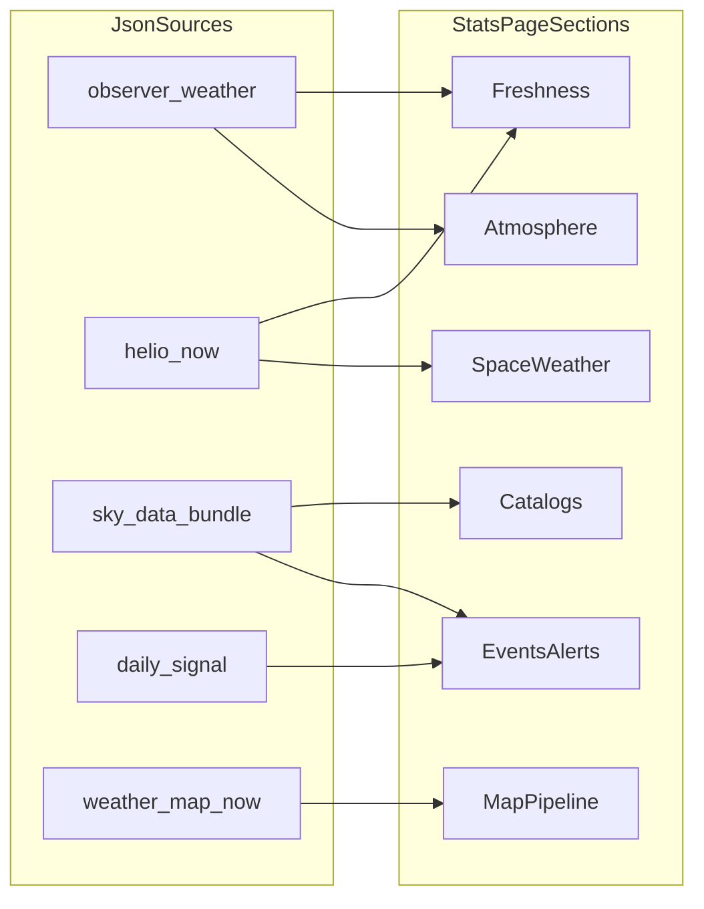

# Stats page — JSON and analytics audit

R&D deliverable for [docs/UI/SPIKE: Stats.md](docs/UI/SPIKE:%20Stats.md). **No code or schema changes** were made to produce this document.

This audit inventories **JSON-shaped data the staging Observer Console and related surfaces actually load** (static files and JSON APIs), classifies each for time and location behavior, and proposes **descriptive**, **temporal**, and **inferential** statistics realistic for a future Stats page. Bulk asset families (hundreds of isobar frame files) are summarized as **logical families**, not one row per file.

Cross-reference for observer coupling: [docs/RnD/Location-Audit.md](docs/RnD/Location-Audit.md).

---

## 1. Executive summary

- The app’s data layer is a **hybrid**: (1) **generated snapshot JSON** under `/data/` and `/sky/data/`, (2) **reference catalogs** (stars, DSO, constellations, Milky Way), (3) **calendar / ranking / alerts** feeds, (4) **weather** via **`/api/astro-weather`** (JSON) with optional legacy static fallback path in code, (5) **map** manifests (`weather_map_now.json`, tile manifests, isobar frames) and third-party JSON (**RainViewer**, **NOAA SWPC** in Helio).
- **Most snapshots are single-panel views**: one `updated_utc` / `generated_utc` per file. True **multi-year analytics** would require **historical retention** not present in the static files alone.
- **High statistical leverage for a Stats page** comes from: **hourly atmospheric + astro blocks** in `observer_weather_now.json` (and API-shaped sibling payloads), **timeline + forecast slices** in `helio_now.json`, **event feeds** (`daily_signal.json`, `alerts_now.json`), **ranking** (`ranking.json`), and **catalogs** (magnitude and type distributions).
- **Existing precedent:** the Sky widget’s [`widget.stats.js`](/sites/staging/sky/widgets/widget.stats.js) already builds **client-side charts from `alerts_now.json`**; a console-wide Stats page should **generalize that pattern** across domains.
- **Inferential statistics** (correlations, trends across weeks, forecasting) are mostly **premature without a time-stamped archive**; **within-snapshot** comparisons and **distributional summaries** are **feasible now**.

---

## 2. Dataset inventory

### 2.1 Observer Console shell ([`index.html`](/sites/staging/index.html))

| Path / API | Role |
|------------|------|
| `/data/observer_weather_now.json` | Hero + observing decision context; hourly arrays, night summary, moon, best window |
| `/data/helio_now.json` | Space weather widget + hero + rails; metrics, scales, forecast slices, alerts |
| `/sky/data/sun_moon.json` | Hero moon strip; alt/az frames vs time |
| `/sky/data/ranking.json` | Right rail “Best objects” |
| `/sky/data/alerts_now.json` | Right rail sky alerts; also Sky stats dialog |
| `/calendar/daily_signal.json` | Calendar widget + rails |

### 2.2 Weather stack

| Path / API | Role |
|------------|------|
| `GET /api/astro-weather?lat&lon&tz&hours&profile&bortle…` | Primary weather JSON ([`weather.js`](/sites/staging/weather/widgets/weather/weather.js)) |
| `/weather/daily_weather.json` | Legacy fallback URL constant when API/multi-location not used |
| `/sky/data/sun_moon.json` | Rise/set enrichment inside weather widget |

### 2.3 Sky map / planetarium ([`sky.data.js`](/sites/staging/sky/core/sky.data.js))

| Path | Role |
|------|------|
| `/sky/data/stars.json` | Star catalog (HYG-limited) |
| `/sky/data/constellations.json` | Constellation lines |
| `/sky/data/milkyway.json` | Milkyway outline |
| `/sky/data/objects_today.json` | Today’s ephemeris objects |
| `/sky/data/alerts_now.json` | Consolidated sky alerts |
| `/sky/data/sun_moon.json` | Sun/moon frames |
| `/sky/data/planets.json` | Planet ephemerides |
| `/sky/data/dso_messier.json` | Messier catalog |
| `/sky/data/ranking.json` | Best objects (loader + map footer) |

**On disk but not referenced in `sky.data.js` loader:** split alert sources such as `alerts_neo.json`, `alerts_risk.json`, etc. — treat as **pipeline intermediates / alternate feeds** unless another entrypoint loads them (none found in quick grep). `objects_week.json` — **no staging reference** found; likely **orphan / future**.

### 2.4 Helio widget ([`helio.widget.ts`](/sites/staging/helio/src/helio.widget.ts))

| Source | Role |
|--------|------|
| `dataUrl` (default `/data/helio_now.json`) | Main payload |
| `https://services.swpc.noaa.gov/json/solar_regions.json` | Active regions overlay |
| `https://services.swpc.noaa.gov/json/ovation_aurora_latest.json` | Aurora oval |

### 2.5 Map POC ([`map-poc.html`](/sites/staging/weather/map-poc.html))

| Path / API | Role |
|------------|------|
| `/data/weather_map_now.json` | Layer manifest, **timeline** (`frames[]` ~169 hourly steps), tile profile URLs |
| URLs inside manifest | **Tile manifests** (per-frame cloud / product JSON) |
| URLs inside manifest | **Isobar frame JSON** (`/data/isobars/{world,eu_wide,eu_central,local}/isobar_NNN.json`) — **hundreds of files** |
| `https://api.rainviewer.com/public/weather-maps.json` | Radar frame index |

### 2.6 Optional / standalone widgets (asset scripts)

| Path | Default | Notes |
|------|---------|--------|
| `/data/observer_weather_now.json` | [`widget_observer_weather.js`](/sites/staging/assets/js/widget_observer_weather.js) | Events tab panel |
| `/data/space_weather_now.json` | [`widget_space_weather.js`](/sites/staging/assets/js/widget_space_weather.js) | **Not mounted in main console** (available for embeds) |
| `/calendar/daily_signal.json` | [`widget_runtime.js`](/sites/staging/assets/js/widget_runtime.js) | Calendar |

### 2.7 Location widget ([`location.js`](/sites/staging/weather/widgets/location/location.js))

Uses **external HTTP JSON** (geocode, timezone) — not Nebulacast-hosted datasets; **out of scope** for catalog statistics except “dependency on third parties.”

### 2.8 Non-JSON (boundary)

- **News** in console: **`/news/rss.xml`** — XML, not JSON; Stats page could cite “feed item counts” only if parsed server-side or mirrored to JSON later.

---

## 3. Dataset table

**Legend — time dependency:** `none` (reference), `snapshot` (single issued-at payload), `hourly` (regular grid inside one file), `event` (irregular dated items), `external_live` (third-party refresh). **Loc dep:** `Y` / `N` / `partial`. **Shape:** short description. **Usefulness** for Stats UI: `L` low / `M` medium / `H` high.

| Dataset | Path / endpoint | Domain | Primary entities | Time | Loc | Shape | Generated / static | Consumer | Use |
|---------|-----------------|--------|------------------|------|-----|-------|-------------------|----------|-----|
| Observer weather | `/data/observer_weather_now.json` | Weather | Observer, `hourly[]`, decision, night_summary | hourly grid + snapshot | Y | nested object + series | Generated | Console hero, observer panel | **H** |
| Helio now | `/data/helio_now.json` | Space weather | metrics, scales, forecast arrays, alerts, timelines | snapshot + embedded series | partial | nested | Generated | Helio, hero, rails | **H** |
| Sun/Moon frames | `/sky/data/sun_moon.json` | Sky / cross | `frames[]` sun/moon alt/az | hourly-ish steps in window | Y | frame series | Generated | Sky, hero, weather helper | **H** |
| Ranking | `/sky/data/ranking.json` | Sky | `items[]` scored targets | snapshot | Y | ranked list | Generated | Console rail, Sky | **H** |
| Sky alerts (bundle) | `/sky/data/alerts_now.json` | Alerts | `items[]` grouped | snapshot | partial | feed | Generated | Sky, rails, [`widget.stats.js`](/sites/staging/sky/widgets/widget.stats.js) | **H** |
| Calendar signal | `/calendar/daily_signal.json` | Events | `items[]`, `meta` | event dates | N | feed | Generated | Calendar, rails | **M** |
| Astro weather API | `/api/astro-weather` | Weather | `hours[]` / similar to legacy | hourly in response | Y | series | Dynamic API | Weather widget | **H** |
| Legacy daily weather | `/weather/daily_weather.json` | Weather | hours blob | snapshot | **config** | series | Static path in code | Fallback | **M** when used |
| Star catalog | `/sky/data/stars.json` | Sky | `stars[]`, magnitudes, spectral | `none` (epoch J2000) | N | large array | Reference | Sky | **H** (catalog stats) |
| DSO Messier | `/sky/data/dso_messier.json` | Sky | DSO records | none | N | array | Reference | Sky | **M** |
| Constellations | `/sky/data/constellations.json` | Sky | lines / figures | none | N | graph-like | Reference | Sky | **M** |
| Milky Way | `/sky/data/milkyway.json` | Sky | outline polygons | none | N | geometry | Reference | Sky | **L** |
| Objects today | `/sky/data/objects_today.json` | Sky | ephemeris rows | snapshot day | Y | list | Generated | Sky | **H** |
| Planets | `/sky/data/planets.json` | Sky | planet vectors | snapshot | Y | object | Generated | Sky | **M** |
| Weather map manifest | `/data/weather_map_now.json` | Map | timeline, layer profiles, `updated_utc` | hour-indexed manifest | N | huge nested | Generated | Map POC | **H** (coverage / timing) |
| Isobar frames | `/data/isobars/*/*.json` | Map | pressure level polylines | one instant per file | N | geometry per frame | Generated | Map POC | **M** (per-frame stats only) |
| Tile manifests | URLs from weather_map | Map | URL lists per frame | hourly | N | manifest | Generated | Map POC | **M** |
| RainViewer index | `api.rainviewer.com/.../weather-maps.json` | Map | radar past/future maps | sliding | N | external | Live | Map POC | **L** |
| SWPC solar regions | `services.swpc.noaa.gov/json/solar_regions.json` | Space weather | active regions | external_live | N | array | NOAA | Helio | **M** |
| SWPC ovation | `.../ovation_aurora_latest.json` | Space weather | aurora grid | external_live | N | grid | NOAA | Helio | **M** |
| Space weather panel | `/data/space_weather_now.json` | Space weather | panel-oriented blob | snapshot partial | ? | object | Generated (if built) | Optional widget | **M** if deployed |

---

## 4. Static / descriptive statistics opportunities

Grounded in actual shapes (see samples: [`observer_weather_now.json`](/sites/staging/data/observer_weather_now.json), [`helio_now.json`](/sites/staging/data/helio_now.json), [`stars.json`](/sites/staging/sky/data/stars.json), [`daily_signal.json`](/sites/staging/calendar/daily_signal.json), [`ranking.json`](/sites/staging/sky/data/ranking.json)).

### 4.1 Reference catalogs (`stars`, `dso_messier`, `constellations`)

- **Counts:** stars by magnitude bin (histogram), by spectral class prefix, by hemisphere (`dec` sign).
- **Messier:** counts by object class; magnitude range; sky area / galactic latitude if coordinates available.
- **Constellations:** number of line segments, bounding footprint (basic).

**Usefulness:** **high** for a “Data catalog” section independent of observer.

### 4.2 Snapshot feeds (`alerts_now`, `ranking`, `objects_today`, `daily_signal`)

- **Group frequencies:** `group` / `stream` / `category` bar charts (already the approach in `widget.stats.js` for alerts).
- **Scores:** histogram of `ranking` scores; breakdown of `score_breakdown` fields in calendar items where present.
- **Calendar:** distribution of events by `published_at` month/year; top `source` frequencies.

**Usefulness:** **high** for “What’s active now” and editorial health.

### 4.3 Helio snapshot (`helio_now.json`)

- **Scalars as KPIs:** `kp_latest`, G/R/S scale levels, solar wind speed/Bz if exposed.
- **Alert inventory:** counts by `domain`, severity, `alerts_preview` length vs full list.
- **Forecast ladder:** table or sparkline from `kp_forecast_3h` / similar arrays inside one file.

**Usefulness:** **high** for space-weather summary strip.

### 4.4 Map manifest (`weather_map_now.json`)

- **Operational:** `total_frames`, `step_hours`, `current_index`, fraction history vs forecast phases.
- **Source line:** list `source.products` as coverage checklist.

**Usefulness:** **medium** for “Map data freshness & coverage” (not user-facing science).

---

## 5. Dynamic / time-based statistics opportunities

### 5.1 True multi-point series inside one response (feasible **now** without backend history)

| Source | Variables | Chart ideas |
|--------|-----------|-------------|
| `observer_weather_now.hourly` | cloud %, wind, temp, precip prob, `night` flag | Line chart strip for next 72h; night-only overlay |
| Same + `night_summary` / `decision` | NQI, mode scores | Profile comparison (already conceptually in hero) |
| `sun_moon.frames` | sun/moon altitude | Altitude traces vs time (single location baked in file) |
| `helio_now` | Kp forecast steps, timelines if present | Step chart / ribbon |
| `weather_map_now.timeline.frames` | phase, confidence | Timeline of available frames; gap detection |

**Caveat:** `sun_moon.json` and static observer files match **pipeline site** (see Location audit) — Stats page should label **provenance**.

### 5.2 Event-driven temporal views

- **`daily_signal.json`:** list vs `published_at` (timeline), lead time to event from title parsing vs structured date fields.
- **Alerts:** inter-arrival times between `updated_utc` if stable (low value if updates are batch).

### 5.3 Requires **historical archive** (not in static JSON alone)

- **Week-over-week Kp**, cloud cover climatology at user site, ranking stability, alert rates — label **“feasible after logging.”**
- **Ranking “changes over time”** needs successive `ranking.json` snapshots stored with timestamps.

---

## 6. Inferential / analytical opportunities

### 6.1 Feasible **now** (single snapshot or one joint response)

- **Joint summaries** in `hourly`: correlation-style summaries between cloud and wind, dew point depression vs cloud (mask by `night === true`).
- **Anomaly flags:** e.g. hour where `cloud.total_percent` &gt; P90 of the slice (no Gaussian assumptions needed).
- **Helio:** max Kp in forecast window vs current — simple “stress” indicator.

### 6.2 Feasible **later** (with aligned time series archive)

- **Space weather vs local conditions:** join `helio_now` history to `observer_weather` history on UTC hour — exploratory correlation, **with strong caveats** (confounders, single site).
- **Seasonality:** monthly aggregation of observing scores — needs **months** of stored API responses.
- **Alert vs Kp:** lagged counts (e.g. does elevated Kp coincide with more `risk` alerts?) — needs consistent IDs and history.

### 6.3 Weak / **not meaningful** with current data

- **Predictive ML** (forecast improvement beyond upstream models).
- **Causal** claims (“ranking dropped because of CME”) without controlled records.
- **Cross-user** inference — data is effectively **single-tenant** snapshots.

---

## 7. Risks / limitations

1. **Single-site bias:** many `/sky/data/*` and `/data/observer_weather_now.json` traces assume **one pipeline observer**; Stats must show **metadata** (`observer`, `generated_utc`) prominently.
2. **No long history in repo:** files **overwrite** on generation; analytics doc must separate **“per deploy”** vs **“time series product.”**
3. **Volume:** `weather_map_now.json` is **very large**; `isobars` are many files — Stats should summarize **manifest-level** stats, not parse all geometry client-side.
4. **External dependency:** NOAA + RainViewer + geocode APIs — availability and ToS affect live Stats.
5. **RSS/XML** news excluded from strict JSON inventory unless mirrored.
6. **Duplicate concepts:** `space_weather_now.json` vs **`helio_now.json`** — avoid double-counting if both panels surface similar metrics; only one may be live on a given page.

---

## 8. Recommendations for future Stats page structure

**Not UI design — grouping for a later spec.**

| Section (proposed) | Content | Suggested presentation |
|--------------------|---------|------------------------|
| **Overview / freshness** | `updated_utc` / `generated_utc` across key files; staleness flags | Cards + small table |
| **Catalog intelligence** | Stars / DSO / constellations distributions | Histograms, donut by class |
| **Atmosphere & observing** | `observer_weather` hourly + NQI / decision | Line charts, profile matrix |
| **Space environment** | `helio_now` + optional NOAA overlays | KPI row + small multiples |
| **Events & alerts** | Calendar + sky alerts + ranking | Frequency bars, timelines |
| **Map / raster pipeline** | `weather_map_now` timeline + layer coverage | Timeline strip, checklist |
| **Advanced** (collapsed) | Inferential notes, data quality, export hooks | Text + “requires history” callouts |

**Mermaid — data to section mapping:**

---

## 9. Next steps

1. **Product:** Prioritize **two** vertical slices for v1 Stats: (A) **freshness + catalog**, (B) **hourly atmosphere + helio KPIs** (all from existing JSON).
2. **Data:** Decide whether Stats reads **live fetch** (same as app) vs **server-side aggregation** job — affects rate limits and large manifest handling.
3. **History:** If week/month views are desired, specify a minimal **append-only log** (which endpoints, retention, PII).
4. **Alignment:** Reuse patterns from [`widget.stats.js`](/sites/staging/sky/widgets/widget.stats.js) as a **shared chart vocabulary** for the console Stats route.
5. **Location audit follow-up:** When multi-observer JSON exists, add **per-site** breakdown rows to this table.

---

*End of audit — implementation intentionally deferred per spike.*
